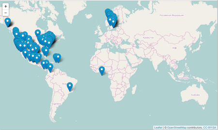
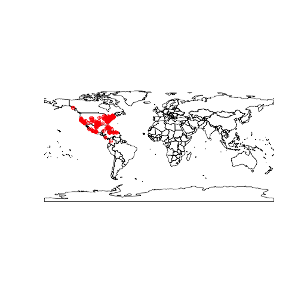
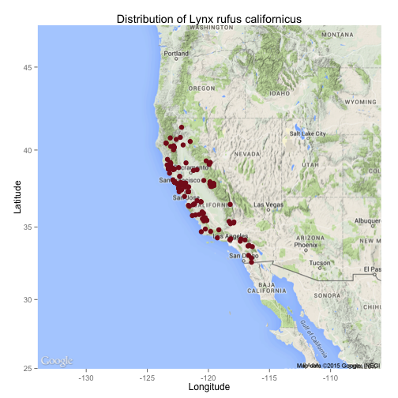

<!--
%\VignetteEngine{knitr::knitr}
%\VignetteIndexEntry{Introduction to mapr}
%\VignetteEncoding{UTF-8}
-->


Introduction to mapr
====================


## Load spocc and mapr


```r
library("spocc")
library("mapr")
```

## Interactive maps

### Leaflet.js

[Leaflet JS](http://leafletjs.com/) is an open source mapping library that can leverage various layers from multiple sources. Using the [`leaflet`](http://cran.rstudio.com/package=leaflet) library, we can generate a local interactive map of species occurrence data.

An example:


```r
spp <- c('Danaus plexippus','Accipiter striatus','Pinus contorta')
dat <- occ(query = spp, from = 'gbif', has_coords = TRUE, limit = 100)
map_leaflet(dat)
```



### Geojson map as a Github gist

You can also create interactive maps via the `mapgist` function. You have to have a Github account to use this function. Github accounts are free though, and great for versioning and collaborating on code or papers. When you run the `map_gist` function it will ask for your Github username and password. You can alternatively store those in your `.Rprofile` file by adding entries for username (`options(github.username = 'username')`) and password (`options(github.password = 'password')`).


```r
spp <- c('Danaus plexippus', 'Accipiter striatus', 'Pinus contorta')
dat <- occ(query = spp, from = 'gbif', has_coords = TRUE, limit = 100)
dat <- fixnames(dat)
map_gist(dat, color = c("#976AAE", "#6B944D", "#BD5945"))
```


## Static maps

### base plots

Base plots, or the built in plotting facility in R accessed via `plot()`, is quite fast, but not easy or efficient to use, but are good for a quick glance at some data.


```r
spnames <- c('Accipiter striatus', 'Setophaga caerulescens', 'Spinus tristis')
out <- occ(query = spnames, from = 'gbif', has_coords = TRUE, limit = 100)
map_plot(out, cex = 1, pch = 10)
```



### ggplot2

`ggplot2` is a powerful package for making visualizations in R. Read more about it [here](https://cran.rstudio.com/web/packages/ggplot2/).


```r
dat <- occ(query = 'Lynx rufus californicus', from = 'gbif', has_coords = TRUE, limit = 200)
map_ggplot(dat, map = "usa")
```


### ggmap

Using the `ggmap` package we can create a ggplot, but with map data behind the points.


```r
map_ggmap(dat)
```



## Various inputs

All functions take the following four kinds of inputs:

* An object of class `occdat`, from the package `spocc`. An object of 
this class is composed of many objects of class `occdatind`
* An object of class `occdatind`, from the package `spocc`
* An object of class `gbif`, from the package `rgbif`
* An object of class `data.frame`. This data.frame can have any columns, but
must include a column for taxonomic names (e.g., `name`), and for latitude 
and longitude (we guess your lat/long columns, starting with the default 
`latitude` and `longitude`). 
